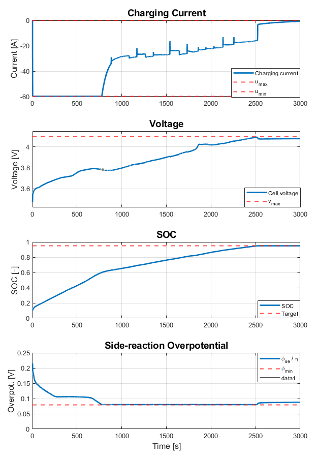

# Lithium-Ion Cell-Level Optimal Fast Charge Algorithm using MPC and EKF with a Physics-Based Reduced Order Model

This repository contains an implementation of a **fast-charging control algorithm** for lithium-ion cells using a **physics-based reduced-order model (ROM)**, an **Extended Kalman Filter (EKF)** for state estimation, and a **Model Predictive Controller (MPC)** with inequality constraints solved via **Hildreth’s algorithm**.

The code targets an NMC30 (3.7V, 30Ah) lithium-ion cell model, developed by Prof. Gregory Plett and Prof. Scott Trimboli \[1], and demonstrates constrained MPC for safe and accelerated charging.

---

## Background

This repository builds on the computational framework described in \[2], extending it to a working MATLAB implementation for fast-charge protocols. The main goal is to:

* Exploit internal electrochemical states. Specifically the side-reaction overpotential (which is related to lithium plating), rather than relying solely on voltage-based constraints..
* Enable **pseudo-minimum-time charging** while avoiding lithium plating and ensuring safety.
* Provide a modular simulation structure combining model, estimator, and optimizer.

---

## Algorithm Description

The control loop consists of the following major steps each sampling instant:

1. **ROM Simulation (OB\_step)**

   * The reduced-order model (ROM) simulates cell voltage and internal states given the applied current.
   * Implemented in [`OB_step.m`](OB_step.m), derived from the multi-step simulator [`outBlend.m`](outBlend.m).

2. **State Estimation (iterEKF)**

   * The Extended Kalman Filter updates estimates of SOC, electrode stoichiometries, potentials, etc., based on ROM predictions and measured voltage.
   * Initialization via [`initKF.m`](initKF.m). Iterative update via [`iterEKF.m`](iterEKF.m).

3. **MPC Linearization (EKFmatsHandler)**

   * EKF states are converted into linearized state-space form suitable for MPC prediction.
   * [`EKFmatsHandler.m`](EKFmatsHandler.m) generates the augmented matrices with Δi input formulation.

4. **Prediction Matrices (predMat)**

   * Build horizon-based prediction matrices Φ and G for SOC, voltage, and overpotential.
   * Implemented in [`predMat.m`](predMat.m).

5. **MPC Optimization (iterMPC)**

   * Solve the quadratic program to compute the optimal input sequence subject to constraints:

     * Current magnitude and slew limits
     * Voltage bounds
     * Side-reaction overpotential bound (plating constraint)
   * Implemented in [`iterMPC.m`](iterMPC.m), using [`constraintsMPC.m`](constraintsMPC.m) to assemble inequalities.

6. **QP Solver (Hildreth)**

   * If constraints are active, the quadratic program is solved using Hildreth’s dual coordinate ascent method.
   * Implemented in [`hildreth.m`](hildreth.m).

7. **Main Driver (runMPC)**

   * Executes the full loop (ROM → EKF → MPC → current command).
   * Implemented in [`runMPC.m`](runMPC.m).

---

## Repository Structure

* **Main simulation**

  * `runMPC.m` — entry point to run a full charging experiment
* **ROM simulation**

  * `outBlend.m` — full profile ROM simulation
  * `OB_step.m` — single-step ROM for MPC
* **Estimation**

  * `initKF.m` — initialize EKF
  * `iterEKF.m` — EKF iteration
* **MPC preparation**

  * `EKFmatsHandler.m` — builds augmented plant for MPC
  * `predMat.m` — constructs prediction matrices
* **MPC optimization**

  * `initMPC.m` — initialize MPC data structure
  * `iterMPC.m` — single MPC iteration
  * `constraintsMPC.m` — build inequality matrices
  * `hildreth.m` — dual QP solver

---

## Results

Simulation demonstrates:

* Charging from 10% to 95% SOC.
* Enforced safety constraints (voltage, current, overpotential).
* Adaptive current profiles that balance charging speed with electrochemical limits.

### Fast Charge Protocols
Fast Charge Protocol with applied current, voltage and side-reaction overpotential constraints.

---

## Conclusions & Next Steps

* This framework enables **constraint-aware, physics-informed charging protocols**.
* Future extensions: thermal coupling, more detailed degradation mechanisms, experimental validation.

---

## References

\[1] G. L. Plett, & M. S. Trimboli, *Battery Management Systems, Volume III: Physics-Based Methods*. Artech House, 2024.
\[2] M. A. Xavier, A. K. de Souza, K. Karami, G. L. Plett, and M. S. Trimboli, *A Computational Framework for Lithium-Ion Cell-Level Model Predictive Control Using a Physics-Based Reduced-Order Model*, ACC 2021.

---

## Acknowledgments & Copyright

The original source code was developed by Prof. Gregory L. Plett and Prof. M. Scott Trimboli.
This adaptation is provided with attribution for academic and educational purposes.
