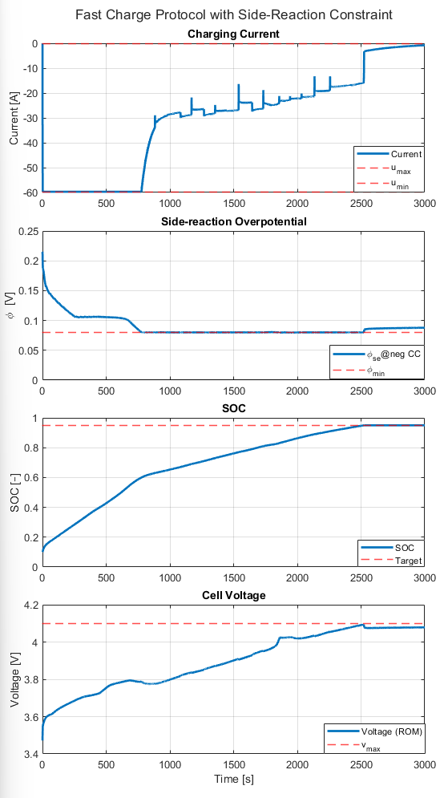
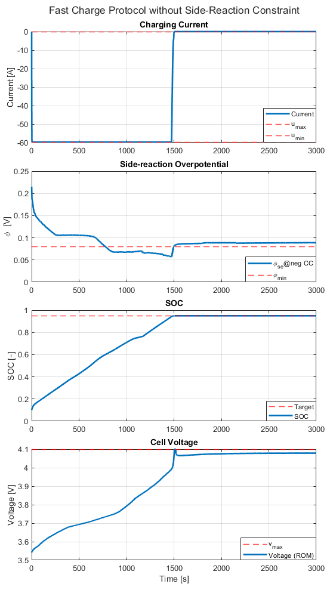

# Lithium-Ion Cell-Level Optimal Fast Charge Algorithm using MPC and EKF with a Physics-Based Reduced Order Model
This repository is distributed under the Creative Commons Attribution-ShareAlike 4.0 International License (CC BY-SA 4.0).

Lithium plating is one of the most critical degradation mechanisms during fast charging. It leads to irreversible lithium loss, reduced capacity, and long-term performance degradation.

To sustain battery life while still enabling high-performance charging, this project implements a **fast-charging control algorithm** for lithium-ion cells. The approach combines a **physics-based reduced-order model (ROM)** with an **Extended Kalman Filter (EKF)** for state estimation and a **Model Predictive Controller (MPC)** that enforces electrochemical and operational constraints, solved efficiently using **Hildreth’s algorithm**.

The code is designed for the **NMC30 (3.7 V, 30 Ah) lithium-ion cell**, using the physics-based reduced-order model developed by **Prof. Gregory Plett and Prof. Scott Trimboli** \[1], and demonstrates how constrained MPC can enable safe yet accelerated charging.

---

## Background

This work builds on the computational framework introduced in \[2], extending it to a complete MATLAB implementation for fast-charge control. The central idea is to move beyond simple voltage-based protections and instead **incorporate internal electrochemical states** into the control loop.

Lithium plating, an electrochemical side reaction at the negative electrode, is particularly problematic during fast charging when lithium diffusion into graphite particles becomes a bottleneck. Following the formulation of Arora et al. \[4], lithium metal is predicted to nucleate near the separator, where electrolyte potentials are highest, and then propagate toward the current collector. This mechanism can be captured within the ROM, making it possible to monitor and constrain the **side-reaction overpotential** directly.

To avoid plating, a conservative threshold of **80 mV** is applied in this project. This threshold serves as a safety margin, ensuring that the charging protocol remains within safe electrochemical limits.

At the same time, the MPC problem is formulated as a **pseudo-minimum-time charging task**, where the cost function penalizes the distance between predicted outputs (via the C-matrix) and the reference trajectory. In effect, the controller seeks the fastest safe path to the target state of charge.

Because these internal states are not directly measurable, an **Extended Kalman Filter (EKF)** is used to provide real-time estimates of SOC, stoichiometries, and electrode potentials. This ensures the MPC can apply constraints not only on measurable variables such as voltage and current, but also on hidden electrochemical states where degradation originates.

Together, this yields a modular and physics-informed control structure that integrates the ROM, EKF, and MPC.

---

## Control Algorithm

The control loop consists of the following major steps each sampling instant:

1. **ROM Simulation (OB\_step)**
   The reduced-order model simulates the battery’s voltage and internal states under the applied current. This provides the plant dynamics used for both state estimation and prediction.
   * Implemented in [`OB_step.m`](src/MPC-EKF4FastCharge/OB_step.m).

2. **State Estimation (iterEKF)**
   The Extended Kalman Filter updates estimates of SOC and electrochemical states using the ROM output and measured voltage. Initialization is performed by [`initKF.m`](src/UTILITY/initKF.m), and state updates are computed in [`iterEKF.m`](src/UTILITY/iterEKF.m).

3. **Model Linearization (EKFmatsHandler)**
      EKF-estimated states are used to select the closest local ROM (no blending) and linearize the system. The [`EKFmatsHandler.m`](src/MPC-EKF4FastCharge/EKFmatsHandler.m) function returns the required state-space matrices, prepared for constraint handling before Δu augmentation.

4. **Prediction Matrices (predMat)**
   The function [`predMat.m`](src/MPC-EKF4FastCharge/predMat.m) builds horizon-based prediction matrices (Φ and G) for SOC, voltage, and side-reaction overpotential.

5. **MPC Optimization (iterMPC)**
   With the prediction matrices, the MPC problem is formulated. The cost function enforces tracking of the SOC reference while respecting limits on:
     * Current magnitude and slew limits
     * Voltage bounds
     * Side-reaction overpotential bound (plating constraint)
   Constraints are assembled in [`constraintsMPC.m`](src/MPC-EKF4FastCharge/constraintsMPC.m), and the optimization is solved in [`iterMPC.m`](src/MPC-EKF4FastCharge/iterMPC.m).

6. **QP Solver (Hildreth)**
   If constraints are active, the quadratic program is solved using Hildreth’s dual coordinate ascent method [`hildreth.m`](src/MPC-EKF4FastCharge/hildreth.m), which is computationally efficient and suitable for embedded implementation.

7. **Main Driver (runMPC)**
   The loop is executed by [`runMPC.m`](src/MPC-EKF4FastCharge/runMPC.m), which integrates ROM simulation, EKF estimation, MPC optimization, and current application step by step.
   * ROM → EKF → MPC → current command.

---

## Results

Simulations highlight the ability of the framework to enforce electrochemical constraints while accelerating charging from **10% to 95% SOC**.
The following operating limits were applied:

* Maximum charge current: **2C (≈ 59.72 A)**
* Maximum cell voltage: **4.1 V**
* Minimum side-reaction overpotential: **0.08 V**
* Prediction horizon: **Np = 5**
* Control horizon: **Nc = 2**

### Fast Charge Protocols Discussion
  
*Fast charge protocol with applied current, voltage, and side-reaction overpotential constraints.*  

  
*Fast charge protocol with applied current and voltage but without side-reaction overpotential constraints. This plot is from development, where a PDE solver was used to complement the ROM solution, since the ROM becomes less accurate beyond 80% SOC.*  

When the **side-reaction overpotential constraint is enforced**, the MPC adaptively reduces the applied current as the electrode potentials approach the plating threshold. At the beginning of the simulation, the charging profile resembles a **constant-current/constant-voltage (CC–CV)** trajectory. However, as the MPC foresees a violation risk, it proactively reduces current, as shown in the figure. Subsequent current calculations then allow charging to continue as aggressively as possible while respecting the constraint.

By contrast, when **no overpotential constraint is imposed**, the controller follows a classic CC–CV profile, completing the 10–95% SOC charge in about **1,500 seconds**. While faster, this trajectory risks lithium plating.

In both cases, the **voltage limit is reached just before the SOC target**, typical of Li-ion fast charging. These results highlight that **operating within electrochemical limits extends lifetime but at the cost of longer charging times** compared to unconstrained CC–CV. This also insight that plating can occur even before 100% SOC if an applied current pulse drives local electrode potentials too low.

---

## Conclusions & Next Steps

The simulations demonstrate that physics-based MPC can actively limit side reactions and degradation mechanisms during fast charging. When overpotential constraints are included, the controller naturally transitions into a CC/Cη regime, reducing the risk of lithium plating.

This exposes a key trade-off: faster charging is achievable with unconstrained CC–CV strategies, but at the cost of increased degradation risk. By contrast, constraint-aware MPC slows charging slightly but safeguards capacity, electrolyte stability, and safety.

The framework shows that **constraint-aware, physics-informed charging protocols** are both feasible and effective, and can be implemented on embedded processors. Viability has also been confirmed experimentally, as shown in related work [3], with several strategies similar in principle to the one demonstrated here.

Future work includes coupling with thermal models, validating experimentally, incorporating more detailed degradation pathways, and further improving MPC robustness for nonlinear systems.

---

## References

[1] G. L. Plett, & M. S. Trimboli, *Battery Management Systems, Volume III: Physics-Based Methods*. Artech House, 2024.  
[2] M. A. Xavier, A. K. de Souza, K. Karami, G. L. Plett, and M. S. Trimboli, *A Computational Framework for Lithium-Ion Cell-Level Model Predictive Control Using a Physics-Based Reduced-Order Model*, ACC 2021.  
[3] Y. Yin and S.-Y. Choe, *Actively temperature controlled health-aware fast charging method for lithium-ion battery using nonlinear model predictive control* Applied Energy, vol. 271, 2020, Art. no. 115232. 

[4] P. Arora, R. E. White, and M. Doyle, *Capacity fade mechanisms and side reactions in lithium-ion batteries,* Journal of the Electrochemical Society, vol. 145, 1998.

---

## Acknowledgments & Copyright

The physics-based reduced-order model (ROM) for the NMC30 cell, as well as the Extended Kalman Filter (EKF) implementation (initKF.m and iterEKF.m), were originally developed by Prof. Gregory L. Plett and Prof. M. Scott Trimboli.

The ROM single-step simulator (OB_step.m) included here is derived from their (outBlend.m) framework.

This adaptation is provided with attribution for academic and educational purposes.